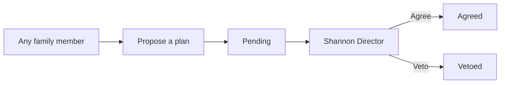
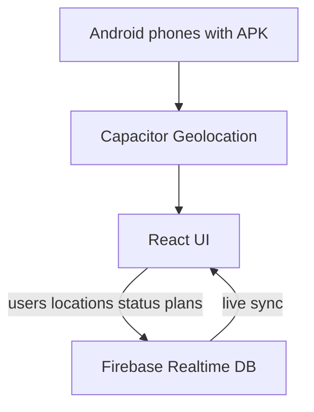

# Shannon’s Birthday Trip — Android App

## Goal

An **installable Android app** for **Shannon’s birthday** road trip that:

- Constantly reinforces this trip is **for Shannon’s birthday**
- Shows **live GPS** of each family member on one map
- Lets **anyone propose plans** along the way
- Makes **Shannon the prime director** — she alone can **agree** or **veto** proposals
- Highlights tourist spots along the route and shared trip status
- Feels highly animated and celebratory

## Defaults (locked in)

- **Delivery:** Capacitor + React → Android APK (sideload; no Play Store for v1). Browser preview still works from the same build.
- **Identity:** Display name + avatar color on first open. Optional **“I am Shannon (Director)”** unlock with a **trip PIN** (set in `.env` / config, shared only with Shannon). Everyone else is a Family Member.
- **Plans workflow:** Any user can add a plan (title, optional place/notes, optional day/segment). Plans start as **Pending**. Shannon can **Agree** (approved) or **Veto** (rejected) with optional short note. Approved plans appear on the map when they have coordinates and in an “Shannon said yes” list.
- **Live location:** Foreground GPS → Firebase per user while Sharing is on.
- **Birthday voice:** Copy, section labels, empty states, and motion all restate Shannon’s birthday (not only the hero).
- **Stack:** Vite + React + TS + Framer Motion + Capacitor + Firebase + Leaflet + `@capacitor/geolocation`.

## Shannon as prime director



- Family Members: propose, edit/withdraw **their own** pending plans, view all statuses.
- Shannon (PIN unlocked on that device): Agree / Veto any pending plan; can also propose like everyone else (her proposals auto-agree).
- Non-Shannon devices never see Agree/Veto controls.
- PIN is local unlock for director powers on that phone (not a full account system).

## Birthday reiteration (throughout the app)

Not a one-time banner — recurring cues:

- App name / splash: **Shannon’s Birthday Trip**
- Hero: Shannon as brand-level title
- Section headers tied to her: “Plans for Shannon,” “Shannon’s call,” “Birthday route,” etc.
- Pending/approved empty states: e.g. “Nothing pending — suggest something for Shannon’s birthday”
- Map chrome / footer microcopy reminding it’s her celebration
- Pensacola section framed as birthday peak days
- Soft recurring motion (confetti burst when Shannon **Agrees** a plan)

## Architecture



### Firebase data shape

```ts
// /trips/shannon-birthday-2026/status
{
  whereWeAre: string;
  leavingAt: string;
  headedTo: string;
  updatedAt: number;
  updatedBy?: string;
}

// /trips/shannon-birthday-2026/users/{userId}
{
  name: string;
  color: string;
  lat: number;
  lng: number;
  updatedAt: number;
  sharing: boolean;
}

// /trips/shannon-birthday-2026/plans/{planId}
{
  title: string;
  notes?: string;
  placeName?: string;
  lat?: number;
  lng?: number;
  segment?: string;      // optional tie to route day/leg
  createdById: string;
  createdByName: string;
  createdAt: number;
  status: 'pending' | 'agreed' | 'vetoed';
  decidedAt?: number;
  decisionNote?: string; // Shannon’s optional comment
}
```

Director PIN is **not** stored in Firebase (lives in app env: `VITE_SHANNON_DIRECTOR_PIN`). Unlock flag stored on device after Shannon enters it.

## Trip itinerary

| Day | Plan |
|-----|------|
| Sat 7/27 | OKC → Shreveport (~9 AM → 3–4 PM) |
| Sun 7/28 | Full day in Shreveport |
| Mon 7/29 | Shreveport → Pensacola (~10 AM → 10–11 PM) |
| Tue–Wed 7/30–31 | Two full days in Pensacola (birthday peak) |
| Thu 8/1 | Pensacola → Lake Village, AR (~10 AM → 8 PM) |
| Fri 8/2 | Lake Village → OKC (possible family stop) |

## App structure

1. **First-launch setup** — name, color; optional “Unlock Shannon Director” with PIN; short note that location is family-trip only and plans need Shannon’s OK.
2. **Hero** — Shannon’s Birthday Trip (dominant brand + motion).
3. **Live family map** — each user; destination; route; tourist spots; pins for **Agreed** plans.
4. **Sharing controls** — location on/off; recenter.
5. **Plans for Shannon** (core section)
   - Compose: title, notes, optional place / link to a tourist spot, optional day
   - Tabs or filters: Pending · Agreed · Vetoed
   - Shannon-only Agree / Veto actions on pending items
   - Celebration animation on Agree
6. **Trip status** — where / leaving / headed.
7. **Itinerary timeline** — Sat 7/27–Fri 8/2 fixed schedule.
8. **Near you / tourist spots** — curated corridor picks.
9. **Pensacola birthday peak**
10. **Footer** — birthday sign-off.

## Live location behavior

- Permission on first Sharing enable; publish ~every 5–10s while app open.
- Stale users dim after ~2 minutes.
- No background tracking when app is killed (v1).

## Tourist spots

Curated spots by route segment. Users can tap a spot → “Propose this for Shannon” pre-fills a plan. Active segment from trip status + optional distance boost from GPS.

## Buc-ee’s along the route (≤20 min detour)

Rule for the app: include every **open** Buc-ee’s that sits on (or within ~20 minutes of) the family’s highway corridor. Exclude stores that require a longer detour or are not open during the trip (7/27–8/2/2026).

### Included (on-corridor / under 20 min)

These fit the natural **I-10 Gulf approach** to and from Pensacola (Shreveport → Pensacola and Pensacola → Lake Village via I-10 west):

| Store | Address | Highway | Why it qualifies |
|-------|---------|---------|------------------|
| **Harrison County / Pass Christian, MS** (#61) | 8245 Firetower Rd, Pass Christian, MS 39571 | I-10 at Menge Ave (Exit 24) | Right off I-10 west of Mobile — on the drive toward Pensacola and again heading home westbound |
| **Loxley / Robertsdale, AL** (#42) | 20403 County Rd 68, Robertsdale, AL 36567 | I-10 Exit 49 | ~0.2–0.3 mi off I-10 between Mobile and Pensacola — last mega-stop before the beach / first stop leaving west |

In app data: tag both as `kind: 'stop'`, brand **Buc-ee’s**, segments `shreveport-pensacola` and `pensacola-lakevillage`, and show them in **Near you now** + map pins when those legs are active. One-tap **“Propose this for Shannon”** should pre-fill a plan.

### Optional (only if outbound goes OKC → DFW → I-20 → Shreveport)

The shortest OKC → Shreveport drive (US-69 corridor) has **no** Buc-ee’s. If the family takes the longer DFW / I-20 path instead:

| Store | Address | Highway | Notes |
|-------|---------|---------|-------|
| **Denton, TX** (#39) | 2800 S Interstate 35 E, Denton, TX 76210 | I-35E | On the OKC → DFW approach |
| **Terrell, TX** (#36) | 506 W. IH 20, Terrell, TX 75160 | I-20 | On I-20 east of Dallas toward Shreveport |

Default app setting: **I-10 Buc-ee’s always on**; Denton/Terrell shown only if trip status / route mode is “via DFW,” or as optional proposes Shannon can veto.

### Excluded for this trip (wrong corridor, >20 min, or not open yet)

- **Leeds, Athens, Auburn, AL** — not on the Pensacola I-10 path without a large detour
- **St. Augustine / Daytona Beach, FL** — Florida east coast, far from Pensacola
- **Benton, AR** (I-30) — first Arkansas store; **opens Aug 17, 2026** (after this trip ends Aug 2)
- **Ruston, LA** (I-20) — targeted ~2027, not open yet
- All other TX / out-of-corridor stores (Houston, I-45 south, etc.)

Source for live addresses: [buc-ees.com/locations](https://buc-ees.com/locations/).

## Visual direction

Gulf teal / sugar-sand / sunset coral / night navy; expressive birthday typography; intentional motion; Shannon brand-first; no purple / cream-terracotta / newspaper defaults. Plans UI is interaction-first (not a card dump in the hero).

## Project layout (to build)

- `src/components/Hero.tsx`, `UserSetup.tsx`, `SharingToggle.tsx`, `TripMap.tsx`, `NearYou.tsx`, `LiveStatus.tsx`, `PlansBoard.tsx`, `PlanComposer.tsx`, `PlanCard.tsx`, `Timeline.tsx`, `Pensacola.tsx`
- `src/lib/firebase.ts`, `location.ts`, `segments.ts`, `identity.ts`, `director.ts`
- `src/data/itinerary.ts`, `stops.ts`, `touristSpots.ts`
- Capacitor Android project + `.env.example` (`VITE_FIREBASE_*`, `VITE_SHANNON_DIRECTOR_PIN`)
- `README.md` — Firebase, PIN, APK install

## What you need to provide once

1. Firebase Realtime Database + rules for the trip node.
2. A short **Shannon Director PIN** (you choose; put in `.env`).
3. Android Studio to build the APK; family enables install from that source.

## Out of scope (v1)

- Play Store / iPhone
- Full accounts (email/password)
- Background GPS when app closed
- Turn-by-turn nav / paid Places API
- Push notifications for new proposals (can add later)
- Booking/payments

## Success check

- APK installs; each user has a name and live map presence
- Anyone can propose plans; only Shannon’s PIN-unlocked device can Agree/Veto
- Agreed plans show up clearly (list + map when geo’d)
- App repeatedly frames the trip as **Shannon’s birthday**
- Tourist spots and itinerary still support the drive
